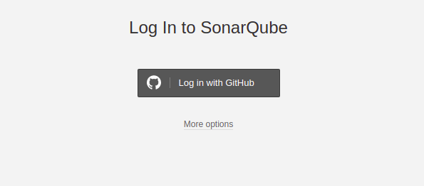
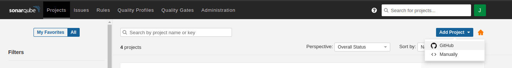
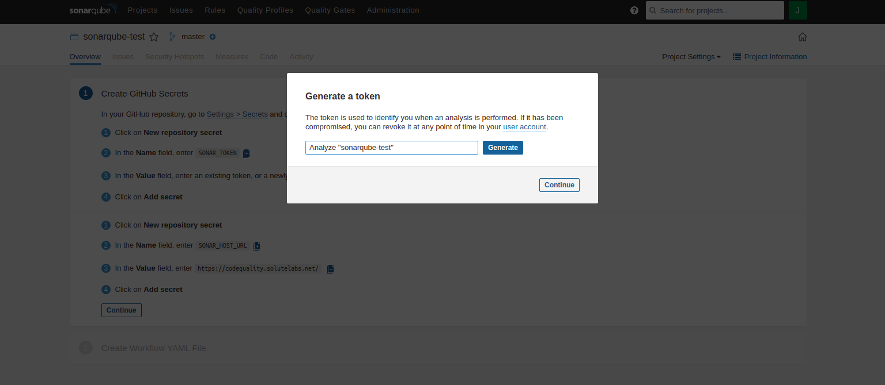
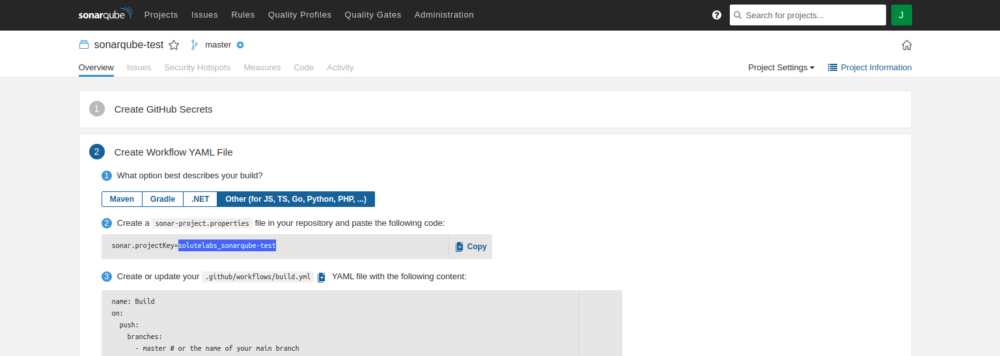

# Sonar-Git-setup
## Steps to configure sonarqube scans and PR decorations
1. Login to https://sonarcube.solutelabs.net/ using _Log in with GitHub_ option and approve for _solutelabs app_ installation in your account

2. After login click on _Add project_ button and select GitHub, in repository dropdown select Solutelabs and look for your repository name and click on _Set up selected repository_

3. Select setup _With GitHub Actions_  and follow the steps mentioned to configure secrets in GitHub

4. In GitHub secrets along with _SONAR_HOST_URL_ and _SONAR_TOKEN_, add the following secret as well _SONAR_PROJECT_KEY_ where the value can be found as shown below, 

5. For configuring workflows add the analyzeBranch.yml and analyzePR.yml files to .github/workflows/ directory
6. After configuration of the workflows you can review analysis under PR section
